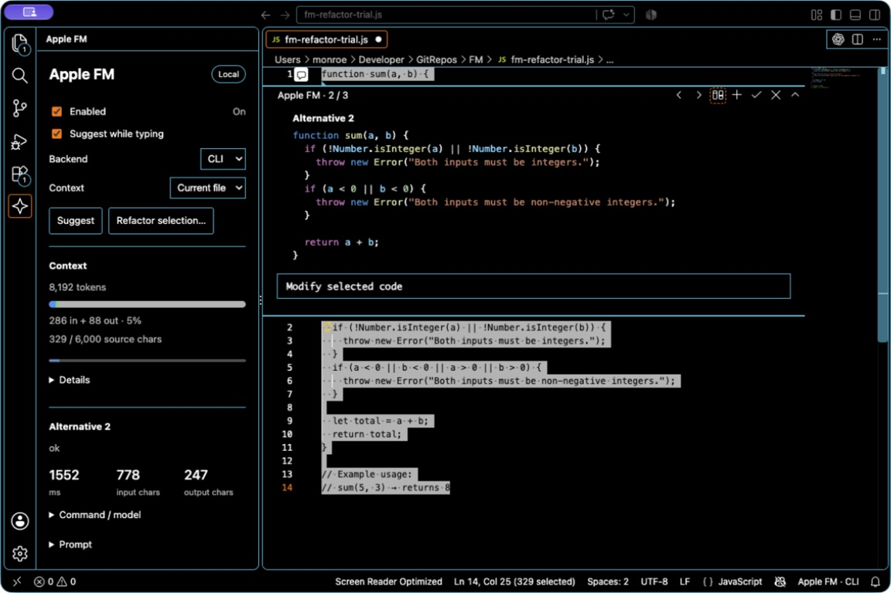

# Apple FM Inline Completion

Experimental inline completion using the on-device Apple Foundation Model on this Mac. Context comes from the live, unsaved document: 2,000 characters before the cursor and 1,000 after, or up to 6,000 with current-file context. Inside a comment, suggestions only continue the comment on that line. On a code line under a comment, the comment is sent as the intent for the code. Tab accepts through VS Code's normal inline completion behavior; Escape dismisses. No branding is added to ghost text.



Browse generated refactors in place, alongside the local model controls and context meter.

## Try

Click **Apple FM** in the status bar to open its side panel. Controls enable/pause the provider, toggle suggestions while typing, select CLI or Swift, and choose nearby or bounded current-file context. **Suggest** requests explicitly, including when automatic suggestions are off.

The panel shows the latest request's model, executable/arguments, full submitted input, elapsed milliseconds, and input/output character counts. This is latest-request data held in memory, not saved history. Apple exposes the system model, not an exact model release identifier. Output counts describe raw backend output, before insertion normalization.

The status bar spins while generating and turns blue when Apple FM returns a suggestion. A brief teal gutter dot confirms an accepted Apple FM suggestion. When several inline providers are enabled, VS Code selects the displayed preview: “ready” does not prove which provider is visible. Other inline providers remain enabled unless you change their settings.

The earlier 0.1.3 update replaces the previous menu with the side panel, strips echoed line prefixes even when the model drops existing indentation, and suppresses repeated automatic requests at an unchanged cursor or immediately after acceptance on that line. Explicit requests remain available. Suggestions can still be semantically wrong; this is a local prototype.

## Refactor highlighted code

Highlight code, then choose **Refactor with Apple FM** from the lightbulb, or **Apple FM: Refactor Selection** from the right-click menu or Command Palette. The side panel also has **Refactor selection…**.

A native widget opens directly below the selection's first line. Enter the change and click **Generate 3**. Alternatives and their changes appear inside the same widget. Its arrow buttons browse results; the diff button toggles between changes and replacement code; **Apply** replaces the captured selection. No diff tab is opened. Native Undo restores an applied edit.

The plus button generates three more (up to nine retained). A new instruction starts a fresh set. Stop cancels unfinished work; Close removes the widget. Source changes block applying old results. Selection size is capped at 6,000 characters and instructions at 1,000. Alternatives remain in memory for the session.

This uses VS Code's stable editor-anchored comment widget as a local refactoring surface. It is not Copilot's inline chat agent: Apple FM requests go directly to the on-device CLI, without a Copilot tool loop. Tab autocomplete remains separate. Refactoring currently uses CLI even when inline completion is set to Swift.

## Context meter

The side panel reads the model's live context capacity (8,192 tokens on the tested Mac). Blue shows tokenized prompt/instructions, green the response text. Private system overhead and transcript framing are excluded, so this is a measured-text meter, not exact total session accounting. A separate bar shows the source-character cap. The current Swift completion helper does not expose its internal prompt for measurement; its counts are marked unavailable. Refactor alternatives start independent requests.

See `MODEL_NOTES.md` for current model controls, the 64 GiB question, and realistic project/agent scope.

## Build and install

```sh
npm install
(cd ../apple-fm-swift && swift build -c release)
npm run package
code --install-extension apple-fm-inline-completion-0.1.8.vsix --force
```

`npm run package` runs `npm test` first, which compiles and runs every `scripts/regression-*.js`, including replays of recorded model replies in `scripts/golden/`. `node scripts/dogfood.js` runs the fixtures in `scripts/dogfood/` against the real model on both backends and marks each suggestion good, none or bad; `--record` saves the replies as new golden files.

Ruby syntax scoring requires Ruby 3.1 or newer because the fixtures use omitted keyword values such as `id:`. Set `APPLE_FM_RUBY` to an absolute path when `ruby` on `PATH` is older or unavailable, for example `APPLE_FM_RUBY=/path/to/ruby npm test`. An unsupported or unavailable Ruby validator is reported as `unchecked` and cannot count as a syntax pass.

### Install or update from a release

On a Mac with Apple Silicon, install the latest public release with the same command for a first install or an update:

```sh
curl -fsSL https://github.com/StoneHub/apple-fm-vscode/releases/latest/download/install.sh | sh
```

The installer downloads the latest VSIX from the GitHub release, verifies its SHA-256 entry from `SHA256SUMS`, and runs the VS Code `code` CLI with `--force`. It does not enable automatic updates. Install VS Code's `code` shell command first if it is not already available; the installer also checks the standard macOS application paths. Reload the VS Code window after installation.

For an already-open window, run **Developer: Reload Window** to load the installed update. The extension details page shows the installed version; reload the window to load that build.

Commands: `Apple FM: Request Suggestion`, `Apple FM: Enable`, `Apple FM: Disable`, and `Apple FM: Open Control Panel`. Set `appleFm.backend` to `swift` for the bundled helper. The optional application-scoped `appleFm.swiftHelperPath` selects an absolute helper path.

The package requires an Apple Silicon Mac running macOS 27 or later with Apple Foundation Models available. The bundled Swift request helper has a macOS 14 minimum, while the context meter helper is built with a macOS 27 minimum. Local files and untitled documents work in trusted or Restricted Mode windows; remote and browser workspaces are excluded. Credential-like filenames are skipped. Releases are unsigned developer previews; no notarization proof is provided.

Remove with `code --uninstall-extension local.apple-fm-inline-completion`.

To prepare a release locally, run `scripts/release.sh`; it writes the VSIX, installer, and `SHA256SUMS` to the ignored `release/` directory. After reviewing those artifacts, the publication command is:

```sh
gh release create "v$(node -p "require('./package.json').version")" release/* --target main --generate-notes
```

## Cloud task preparation

See [cloud work](docs/CLOUD-WORK.md) for supported runner checks, task boundaries and local acceptance gates.
